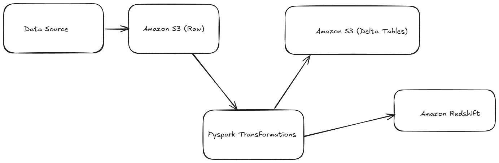

# Data Engineering Project with Pyspark and AWS for Banking

## Overview

This project demonstrates a data engineering pipeline built using PySpark for distributed data processing and Amazon S3 for scalable data storage. This pipeline extracts raw data in various formats, transforms it using Pyspark, and loads the processed data to S3 in an optimized format (delta) or Redshift.

## Architecture

## Features

* **Data ingestion** from multiple sources (CSV, JSON, Parquet)
* **Data transformation** and cleaning using Pyspark
* **Data quality** checks and validations using Pyspark
* **Partitioning** and storage in optimized delta format and Redshift
* **Integration with AWS S3** for scalable storage
* **Configurable pipeline** with JSON configuration files

## Tech Stack